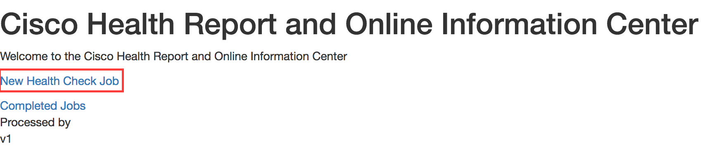
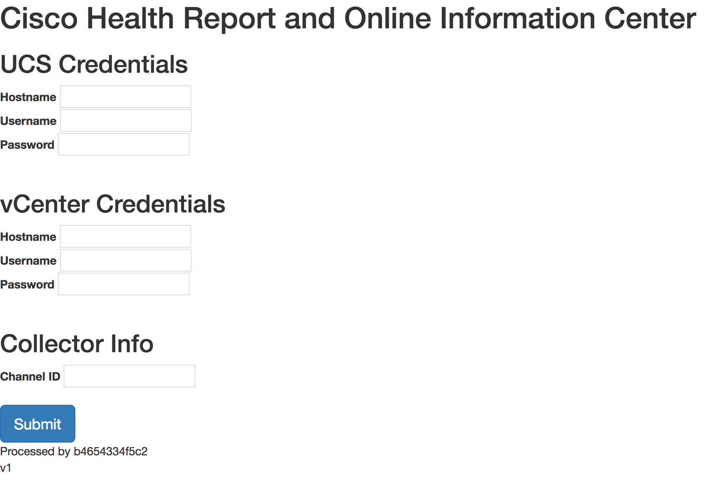
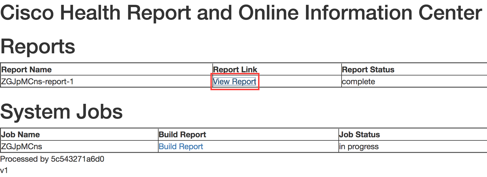
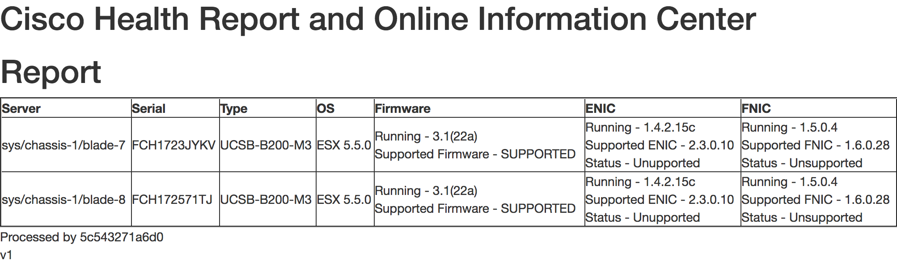

# CHROnIC
##**Cisco Health Report & ONline Information Collector**
This is an application designed to interact with infrastructure components, and perform an online analysis of them.

*The Challenge* - It can be tedious to collect the data needed for routine health analysis. For example, Cisco provides a HCL interface that can be used to verify whether a specific UCS hardware/software/driver configuration is fully supported. Multiple touch points are required across multiple different interfaces in order to verify this information:
1. UCS Manager -> Blade/Rack Model, CIMC Firmware Version, Adapter Model
2. vCenter/vSphere -> vSphere version on host
3. vSphere CLI -> Driver versions for the Ethernet NIC (enic) and Fiber Channel Adapter (fnic)

*The Solution* - Create an application that will enable interaction with UCS from the cloud. This particular application has several microservices, including:

* Bus - Used as a basic HTTP-based message queue
* Collector - On-prem component used to exchange core information between on-prem infrastructure and the Portal. Consumes messages from the queue.
* Portal - Information Collection service and agent used to push tasks into the queue.
* UCS ESX Analyzer - Process data and generate reports which are pushed back into the queue.

Contributors - Josh Anderson, Chad Peterson, Loy Evans

# Installation
The recommended installation process is to first deploy the Bus, then the Collector, then the UCS ESX Analyzer, and finally the Portal.

## Environment

* [Docker Container](#opt1)
* [Native Python](#opt2)

## Docker Installation<a name="opt1"></a>

**Prerequisites:**
The following components are required to locall run this container:
* [Docker](https://docs.docker.com/engine/installation/mac/)

**Get the containers:**
The latest builds of this project is available as Docker images from Docker Hub:
```
docker pull imapex/chronic_bus:latest
docker pull imapex/chronic_collector:latest
docker pull imapex/chronic_ucs_esx_analyzer:latest
docker pull imapex/chronic_portal:latest
```

**Run the application:**
*Note: these instructions assume that you will be running all of the components on a local Docker installation*
```
docker run -d -p 5000:5000 --name bus imapex/chronic_hub:latest
docker run -e chronicbus=127.0.0.1:5000 -d --name collector imapex/chronic_collector:latest
docker run -d -p 5001:5000 -e "CHRONICBUS=http://127.0.0.1:5000" -e "HCL=http://ucshcltool.cloudapps.cisco.com/public/rest" --name analyzer imapex/chronic-ucs-esx-analyzer
docker run -d -p 5002:5000 -e "CHRONICBUS=http://127.0.0.1:5000" -e "CHRONICPORTAL=http://127.0.0.1:5002" -e "CHRONICUCS=http://127.0.0.1:5001" --name portal imapex/chronic-portal
```

**Retrieve the Collector Channel ID from the Collector Logs:**
```
docker logs collector
```
```
Channel ID: xxxxxxxx
```

**Use the Portal to Perform a Discovery:**
* Access http://127.0.0.1:5002 from your browser

* Click "New Health Check Job"

* Enter the IP/Hostname, Username and Password for your UCS Manager
* Enter the IP/Hostname, Username and Password for your vCenter
* Enter the Channel ID found in the logs above
* Click Submit

* You will now be taken to the jobs page. It will take several minutes to collect the relevant information from your UCS Manager, vCenter and vSphere hosts. Refresh the page to view the current status. When complete, a report will be visible in the top section of the jobs page.

* Click the report link to view the report. The report will show you the information about the servers it discovered, and show you whether they are Supported or Unsupported according to the HCL.
